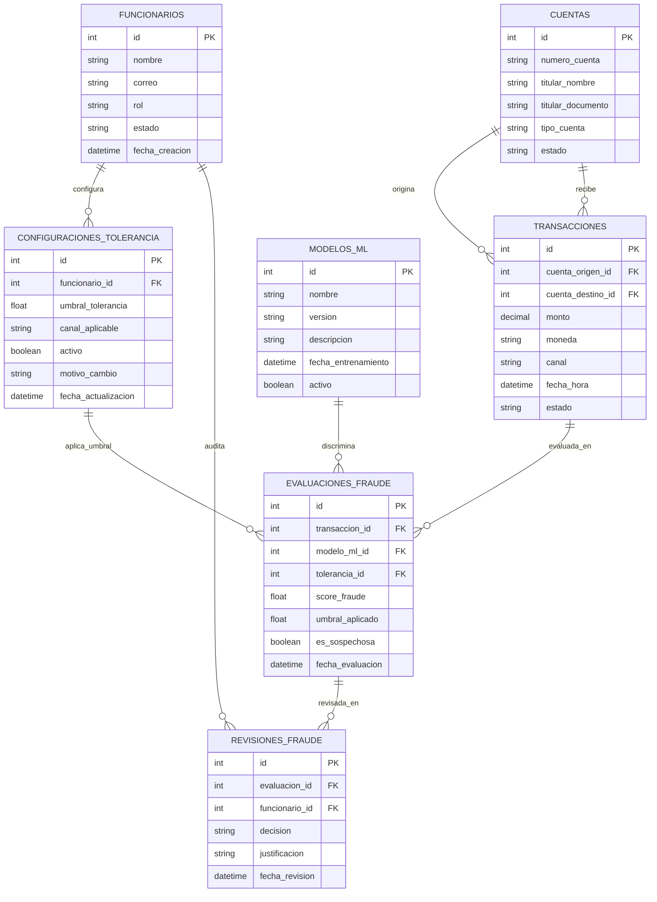

# Modelo Entidad-Relación (MER) - Detección de Fraude Bancario

Diagrama y especificación del Modelo Entidad-Relación (MER) para el sistema de control antifraude bancario, donde los funcionarios ajustan umbrales de tolerancia y un modelo de Machine Learning (ML) pre-entrenado clasifica transacciones sospechosas. Basado en [docs/modelo.md](file:///Users/domicianorincon/Documents/Test/262SeminarioApp1/docs/modelo.md).

---

## Diagrama MER

---

## Detalle de Entidades

### 1. `FUNCIONARIOS`
Representa al usuario del frontend bancario (oficial de cumplimiento, analista de fraude o administrador).
- `id` (PK): Identificador único del funcionario.
- `nombre`: Nombre del analista o funcionario.
- `correo`: Correo corporativo para autenticación y auditoría.
- `rol`: Nivel de permisos (`ANALISTA`, `SUPERVISOR`, `ADMIN`).
- `estado`: Estado operativo (`ACTIVO`, `INACTIVO`).
- `fecha_creacion`: Fecha y hora de alta en el sistema.

### 2. `CONFIGURACIONES_TOLERANCIA`
Almacena el histórico y estado vigente de los umbrales de tolerancia configurados por los funcionarios desde el frontend.
- `id` (PK): Identificador de la configuración.
- `funcionario_id` (FK): Funcionario responsable de establecer el umbral.
- `umbral_tolerancia`: Valor numérico (0.0 a 1.0). Si el score estimado por el modelo de ML es mayor o igual a este valor, la transacción se marca como sospechosa.
- `canal_aplicable`: Canal bancario al que aplica (`TODOS`, `MOVIL`, `WEB`, `CAJERO`, `POS`).
- `activo`: Booleano que indica si es la regla vigente aplicada en producción.
- `motivo_cambio`: Justificación comercial o regulatoria ingresada al ajustar el umbral.
- `fecha_actualizacion`: Marca de tiempo del cambio.

### 3. `CUENTAS`
Cuentas bancarias de clientes involucradas en las transacciones.
- `id` (PK): Identificador de cuenta.
- `numero_cuenta`: Número identificador de la cuenta bancaria.
- `titular_nombre`: Nombre del cuentahabiente.
- `titular_documento`: Documento de identidad del titular.
- `tipo_cuenta`: Tipo de producto (`AHORROS`, `CORRIENTE`).
- `estado`: Situación operativa (`ACTIVA`, `BLOQUEADA`).

### 4. `TRANSACCIONES`
Operaciones financieras sujetas a evaluación y scoring de riesgo.
- `id` (PK): Identificador de la transacción.
- `cuenta_origen_id` (FK): Cuenta emisora de fondos.
- `cuenta_destino_id` (FK): Cuenta receptora (opcional en retiros o pagos en datafono).
- `monto`: Monto económico de la operación.
- `moneda`: Moneda utilizada (`COP`, `USD`, etc.).
- `canal`: Medio por el cual se originó (`MOVIL`, `WEB`, `CAJERO`, `POS`).
- `fecha_hora`: Momento exacto del intento de transacción.
- `estado`: Estado del flujo bancario (`PENDIENTE`, `APROBADA`, `RECHAZADA`, `EN_REVISION`).

### 5. `MODELOS_ML`
Catálogo de modelos de Machine Learning pre-entrenados para la discriminación de transacciones.
- `id` (PK): Identificador del modelo.
- `nombre`: Nombre del algoritmo o pipeline (ej. `FraudDetector-XGBoost`).
- `version`: Tag de versión desplegada (ej. `v1.2.0`).
- `descripcion`: Descripción del pipeline o entrenamiento.
- `fecha_entrenamiento`: Fecha de construcción del artefacto.
- `activo`: Booleano que indica si está en servicio activo.

### 6. `EVALUACIONES_FRAUDE`
Inferencia y discriminación ejecutada por el modelo de ML, contrastada con la tolerancia vigente.
- `id` (PK): Identificador de la evaluación.
- `transaccion_id` (FK): Transacción evaluada.
- `modelo_ml_id` (FK): Modelo de ML que ejecutó la inferencia.
- `tolerancia_id` (FK): Configuración de tolerancia aplicada.
- `score_fraude`: Probabilidad continua estimada por el modelo (0.0 a 1.0).
- `umbral_aplicado`: Valor del umbral al momento de la inferencia.
- `es_sospechosa`: `true` si `score_fraude >= umbral_aplicado`.
- `fecha_evaluacion`: Fecha y hora de la inferencia.

### 7. `REVISIONES_FRAUDE`
Auditoría de las revisiones manuales realizadas desde el frontend por el funcionario bancario.
- `id` (PK): Identificador de la revisión.
- `evaluacion_id` (FK): Evaluación revisada.
- `funcionario_id` (FK): Funcionario que revisó el caso.
- `decision`: Veredicto manual (`CONFIRMADO_FRAUDE`, `FALSO_POSITIVO`, `APROBADO_MANUAL`).
- `justificacion`: Justificación de la decisión tomada.
- `fecha_revision`: Fecha y hora de resolución del caso.

---

## Relaciones

- `FUNCIONARIOS` (1:N) `CONFIGURACIONES_TOLERANCIA`: Un funcionario puede registrar múltiples configuraciones de tolerancia en el tiempo.
- `FUNCIONARIOS` (1:N) `REVISIONES_FRAUDE`: Un funcionario puede auditar múltiples evaluaciones sospechosas.
- `CUENTAS` (1:N) `TRANSACCIONES`: Una cuenta puede originar o recibir múltiples transacciones.
- `TRANSACCIONES` (1:N) `EVALUACIONES_FRAUDE`: Una transacción pasa por una o más evaluaciones del modelo.
- `MODELOS_ML` (1:N) `EVALUACIONES_FRAUDE`: Un modelo entrenado ejecuta múltiples inferencias.
- `CONFIGURACIONES_TOLERANCIA` (1:N) `EVALUACIONES_FRAUDE`: Un umbral de tolerancia se aplica a múltiples evaluaciones.
- `EVALUACIONES_FRAUDE` (1:N) `REVISIONES_FRAUDE`: Una evaluación sospechosa puede tener una o más revisiones manuales.
